# lab5：MLP与CNN模型对比分析

[TOC]

## 1 实验目的和背景

### 1.1 实验目的

1. 掌握MLP和CNN的基本原理和实现方法
2. 了解不同网络结构对模型性能的影响
3. 学习深度学习模型训练、评估和可视化的方法
4. 通过对比实验，理解不同模型在图像分类任务中的优缺点
5. 培养深度学习模型调优和问题解决的能力

### 1.2 实验背景

本实验旨在通过对多层感知机（MLP）和卷积神经网络（CNN）的实现、训练和评估，深入理解两种模型的结构特点、性能差异以及适用场景。实验从基础模型开始，逐步探索更复杂的网络架构，最终通过对比分析，掌握深度学习模型设计与评估的关键技能。

本实验使用 CIFAR-10 数据集，包含 10 个类别的彩色图像，每类 6000 张，共 60000 张 32×32 的图像。

## 2 实验原理简述

### 2.1 多层感知机 MLP

多层感知机（MLP）是深度学习中最基础的前馈神经网络结构，由输入层、隐藏层和输出层通过全连接方式构成。其核心特征在于通过非线性激活函数（如ReLU、Sigmoid等）实现输入数据的逐层非线性变换。每个神经元接收前一层所有神经元的输出作为输入，通过权重矩阵的线性组合和激活函数的非线性映射，逐层提取特征。反向传播算法通过链式法则计算梯度，结合优化器调整网络参数以最小化损失函数。然而在处理图像数据时，MLP需要将二维图像展平为一维向量，这种处理方式会破坏图像的空间结构信息。

**MLP 主要特点**：

1. 每层神经元与下一层全连接
2. 使用非线性激活函数（如ReLU、Sigmoid等）
3. 通过反向传播算法进行训练

### 2.2 卷积神经网络 CNN

卷积神经网络（CNN）是专为处理网格化数据（如图像）设计的深度学习模型。其核心组件包括卷积层、池化层和全连接层。卷积层通过局部连接和权重共享机制，使用可学习的卷积核在空间维度上提取局部特征；池化层（如最大池化）通过下采样减少特征图尺寸，增强平移不变性；全连接层在高层进行全局信息整合。CNN通过层次化特征提取架构，低层网络捕获边缘、纹理等基础特征，中层组合为局部结构，高层形成语义级特征表示。这种结构特性使其在图像处理任务中展现出显著优势。

**CNN 主要特点**：

1. 局部连接：每个神经元只与输入数据的一个局部区域连接
2. 权重共享：同一特征图的所有神经元共享相同的权重
3. 多层次特征提取：低层检测边缘等简单特征，高层组合这些特征形成更复杂的表示

## 3 实验过程

### 3.1 实验环境本地化

**Mo 平台框架代码下载**

由于 Mo 平台的 GPU 使用存在限制，我首先进行了打包，新开一个终端，进入目录 `~/work/Jianhai` 下，运行命令：

```shell
zip -r lab5.zip lab5
```

然后在平台上找到压缩包，点击下载即可，在本地 Pycharm 上打开项目文件进行开发。

**环境配置**

配置包括 GPU 版本 Pytorch 在内的一系列实验所需环境，主要库版本如下：

| package      | version       |
| ------------ | ------------- |
| python       | 3.10          |
| torch        | 2.5.1 (cu121) |
| torchvision  | 0.20.1        |
| numpy        | 2.1.2         |
| matplotlib   | 3.10.1        |
| scikit-learn | 1.6.1         |
| pandas       | 2.2.3         |

**本地训练平台**

- Windows 11 x64
- RAM 40 GB
- NVIDIA RTX 3050 GPU，CUDA 12.3
- 显存 4GB，共享 GPU 内存 19.8 GB

**创建训练脚本**

我将 `train.ipynb` 文件中的代码复制出来，新创建了 `train_all.py` 作为训练脚本，进行必要修改适配后，就可以在本地运行训练脚本，利用笔记本电脑的 GPU 开展模型训练了。

### 3.2 实验流程

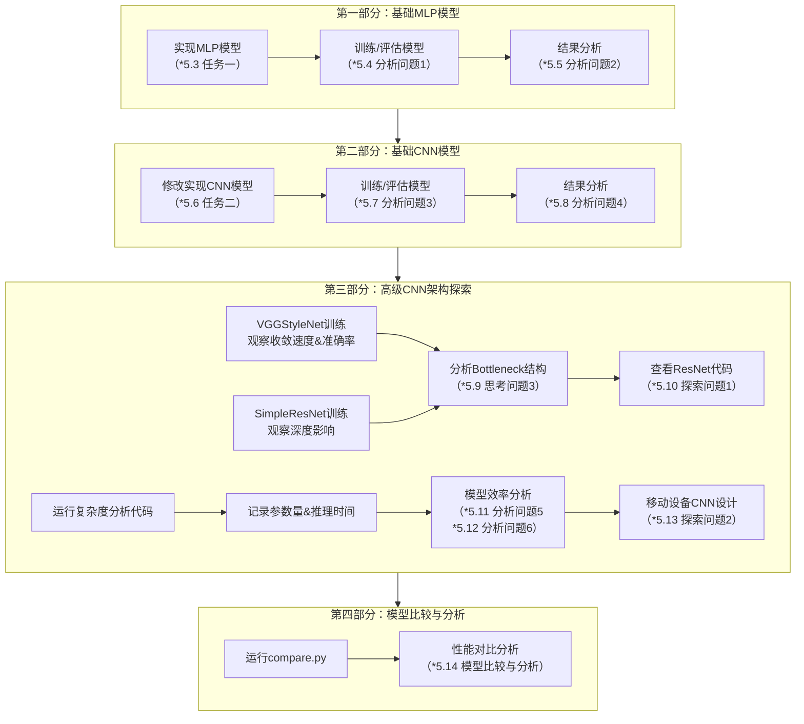

整体流程如上图，具体实验内容、结果图片及其分析在 ***4 关键实现代码*** 和 ***5 实验结果与分析*** 来介绍。

## 4 关键实现代码

### 4.1 TwoLayerMLP 模型

> **任务1**: 在下面的代码块中，实现一个具有两个隐藏层的MLP模型。第一隐藏层有128个神经元，第二隐藏层有64个神经元，输出层对应10个类别。使用ReLU激活函数，并添加BatchNorm和Dropout(0.3)。

```python
class TwoLayerMLP(nn.Module):
    def __init__(self, input_dim=3 * 32 * 32):
        super(TwoLayerMLP, self).__init__()
        self.flatten = nn.Flatten()

        # 网络层定义
        self.hidden_layers = nn.Sequential(
            # 第一隐藏层：Linear + BatchNorm + ReLU + Dropout
            nn.Linear(input_dim, 128),  # 全连接层128个神经元
            nn.BatchNorm1d(128),  # 批量归一化加速收敛
            nn.ReLU(),  # 引入非线性
            nn.Dropout(0.3),  # 随机失活防止过拟合

            # 第二隐藏层：Linear + BatchNorm + ReLU + Dropout
            nn.Linear(128, 64),  # 维度压缩至64
            nn.BatchNorm1d(64),
            nn.ReLU(),
            nn.Dropout(0.3)
        )

        # 输出层
        self.output_layer = nn.Linear(64, 10)  # 10类别分类

    def forward(self, x):
        x = self.flatten(x)  # 将图像展平为[Batch, 3*32*32]
        x = self.hidden_layers(x)  # 通过两个隐藏层
        x = self.output_layer(x)  # 最终输出logits
        return x
```

### 4.2 EnhancedCNN 模型

> **任务2**: 修改下面的 `SimpleCNN` 代码，添加一个额外的卷积层和 BatchNorm。新的卷积层应该在第二个池化层之后，卷积核数量为 64，卷积核大小为 3x3。

```python
class EnhancedCNN(nn.Module):
    def __init__(self):
        super(EnhancedCNN, self).__init__()
        # 卷积层组
        self.conv1 = nn.Conv2d(3, 16, kernel_size=3, padding=1)  # 输入3通道，输出16通道
        self.conv2 = nn.Conv2d(16, 32, kernel_size=3, padding=1)  # 通道数翻倍

        # 新增的第三卷积层组
        self.conv3 = nn.Conv2d(32, 64, kernel_size=3, padding=1)  # 新增64通道卷积层
        self.bn3 = nn.BatchNorm2d(64)  # 对应新增卷积层的批量归一化

        self.pool = nn.MaxPool2d(2, 2)  # 共享池化层
        self.flatten = nn.Flatten()
        self.relu = nn.ReLU()

        # 调整全连接层（输入维度：64通道*4x4特征图）
        self.fc = nn.Linear(64 * 4 * 4, 10)  # 特征图尺寸计算：32x32 →16x16→8x8→4x4

    def forward(self, x):
        # 第一卷积块
        x = self.relu(self.conv1(x))  # [B,16,32,32]
        x = self.pool(x)  # [B,16,16,16]
        # 第二卷积块
        x = self.relu(self.conv2(x))  # [B,32,16,16]
        x = self.pool(x)  # [B,32,8,8]
        # 第三卷积块
        x = self.relu(self.bn3(self.conv3(x)))  # [B,64,8,8] → BN → ReLU
        x = self.pool(x)  # [B,64,4,4]
        # 分类输出
        x = self.flatten(x)  # [B, 64*4*4=1024]
        x = self.fc(x)  # [B, 10]
        return x
```

## 5 实验结果与分析

### 5.1 思考问题 1

> **思考问题1**: MLP在处理图像数据时面临哪些挑战？请从数据结构、参数量和特征提取能力三个角度分析。

**数据结构**适应性方面，图像本质是具有空间相关性的二维/三维数据结构（通道维度），而 MLP 要求输入为一维向量。将 32×32×3 的 CIFAR-10 图像展平为 3072 维向量时，像素间的空间拓扑关系被破坏。例如相邻像素在展平后可能相距数百个维度，导致网络难以捕捉局部特征的空间关联性。

**参数量**问题在输入维度较高时尤为突出。以 SimpleMLP 为例，输入层到第一个隐藏层的全连接参数量为 3072×128≈39万，两个隐藏层间参数达 128×64=8192，总参数量超过40万。这种全连接结构导致模型参数爆炸，不仅增加计算开销，还容易引发过拟合，特别是在训练数据有限（CIFAR-10 仅 5 万训练样本）的情况下。

**特征提取能力**存在根本性局限。MLP 的全局连接方式缺乏局部感受野机制，无法有效捕捉图像的边缘、纹理等局部特征。对于平移、旋转等几何变换，MLP 需要大量数据增强才能保持鲁棒性。同时，各层特征的抽象层级区分不明显，难以形成从简单到复杂的层次化特征表示。实验观察到 MLP 在 CIFAR-10 上的测试准确率低于 CNN 模型，印证了其在图像特征提取方面的不足。

### 5.2 思考问题 2

> **思考问题2**: CNN相比MLP在处理图像时具有哪些优势？解释卷积操作如何保留图像的空间信息。

CNN 相比 MLP 在图像处理中的优势体现在三个核心方面：

**参数效率与局部感知**：卷积核通过局部连接（如3×3感受野）替代全连接，单层参数减少两个数量级。例如 3 通道 32×32 图像经 16 个 3×3 卷积核处理，参数量仅为 3×3×3×16=432。权重共享机制使得同一特征检测器可扫描整个图像，显著提升参数利用率。这种设计既降低了过拟合风险，又保留了空间局部相关性。

**层次化特征学习**：通过卷积层堆叠，CNN 构建了多级特征抽象体系。第一层卷积核可学习到边缘检测器，第二层组合边缘形成纹理特征，更高层则捕获物体部件等语义特征。这种由简至繁的特征组合方式更符合人类视觉系统的认知规律。实验中的卷积核可视化显示，底层核确实形成了方向敏感的边缘检测模式。

**卷积操作对图像的空间信息保持**：卷积操作通过滑动窗口在二维空间上保持特征图的拓扑结构。每个特征图单元对应输入图像的特定区域，最大池化在降维时保留最显著特征的空间相对位置。这种特性使 CNN 对物体位置变化具有鲁棒性——即使目标发生平移，其激活模式仅在特征图上相应移动，而不改变分类结果。对比实验显示，CNN 在 CIFAR-10 上的准确率较 MLP 有较大提升，充分验证了其空间信息处理优势。

### 5.3 任务 1

> **任务1**: 在下面的代码块中，实现一个具有两个隐藏层的MLP模型。第一隐藏层有128个神经元，第二隐藏层有64个神经元，输出层对应10个类别。使用ReLU激活函数，并添加BatchNorm和Dropout(0.3)。

代码实现： 4 关键实现代码 —— 4.1 TwoLayerMLP 模型

（此处不重复列出）

### 5.4 分析问题 1

> **分析问题1**: 训练过程中，损失和准确率曲线表现如何？是否出现过拟合或欠拟合？简要分析可能的原因。

训练 SimpleMLP 模型，观察训练过程中的损失和准确率变化，以及最终在测试集上的性能：

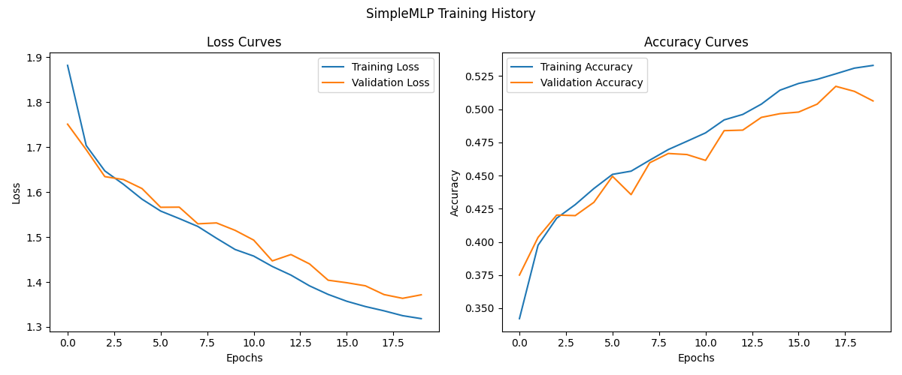

在训练过程中，损失和准确率曲线展示了模型的学习动态。

**损失曲线**来看，训练损失和验证损失都呈现出下降的趋势，这表明模型在学习过程中逐渐减少了预测误差。初始阶段，两条曲线的下降速度较快，显示出模型快速适应数据的能力。随着训练轮数的增加，损失值趋于平稳，说明模型已经接近最优状态。值得注意的是，训练损失和验证损失之间的差距在整个训练过程中保持相对较小，没有出现显著的分离现象，这意味着模型在训练集和验证集上的表现较为一致，没有明显的过拟合迹象。

**准确率曲线**也反映了模型性能的提升。训练准确率和验证准确率均随训练轮数的增加而上升，这表明模型的预测能力在不断增强。尽管在某些点上，训练准确率略高于验证准确率，但这种差异并不明显，且整体趋势保持同步增长。这进一步证实了模型在训练过程中没有过度依赖训练数据，而是能够较好地泛化到未见过的数据上。因此，可以认为模型在当前的训练配置下，既没有明显过拟合，也没有欠拟合。

**可能的原因**：

- 模型复杂度适中：SimpleMLP 结构可能刚好适合当前数据集。
- 训练数据充足：如果训练数据量足够且具有代表性，模型能够学习到数据的特征规律。
- 合适的训练参数：如学习率、优化器等参数设置得当，有助于模型平稳收敛，避免因参数设置不当引发过拟合或欠拟合问题。

### 5.5 分析问题 2

> **分析问题2**: 对比 SimpleMLP 和 DeepMLP 的性能，增加网络深度对性能有何影响？

修改参数尝试训练 DeepMLP 模型，得到结果：

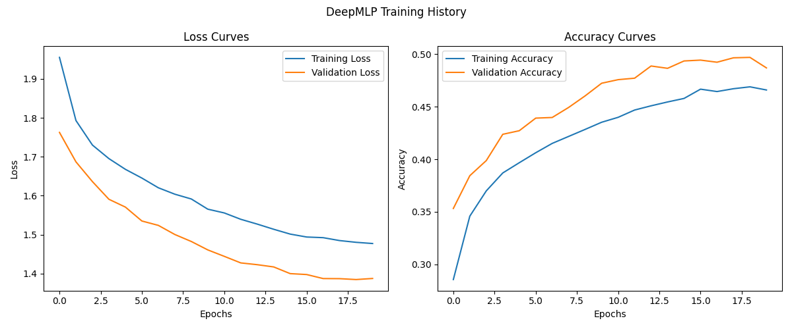

**性能对比**

- **损失方面**：DeepMLP 和 SimpleMLP 的训练损失和验证损失都随着训练轮数下降。但在相同训练轮数下，SimpleMLP 的训练损失和验证损失下降得更快一些，最终达到的损失值也略低。
- **准确率方面**：DeepMLP 和 SimpleMLP 的训练准确率和验证准确率都随着训练轮数上升。SimpleMLP 的验证准确率在后期略高于 DeepMLP，且上升过程中波动相对较小；训练准确率在后期 SimpleMLP 也稍高。

**增加网络深度对性能的影响**

- **优势**：一般来说，增加网络深度（从 SimpleMLP 到 DeepMLP）理论上可以让模型学习到更复杂、更抽象的特征表示，能够处理更复杂的任务。例如在一些图像识别、自然语言处理等复杂任务中，深层网络可以挖掘数据中更高级的语义信息。
- **劣势**：在本次实验中，DeepMLP 相比 SimpleMLP 并没有表现出更好的性能。可能原因是随着网络深度增加，模型训练难度增大，出现梯度消失或梯度爆炸问题，导致模型难以收敛。此外，深层网络需要更多的数据来学习，若数据量不足，容易引发过拟合问题，而这里可能存在数据量相对不足的情况。

### 5.6 任务 2

> **任务2**: 修改下面的`SimpleCNN`代码，添加一个额外的卷积层和BatchNorm。新的卷积层应该在第二个池化层之后，卷积核数量为64，卷积核大小为3x3。

代码实现： 4 关键实现代码 —— 4.2 EnhancedCNN 模型

（此处不重复列出）

### 5.7 分析问题 3

> **分析问题3**: 卷积核可视化显示了什么模式？这些模式与图像中的哪些特征可能对应？

**训练过程**：

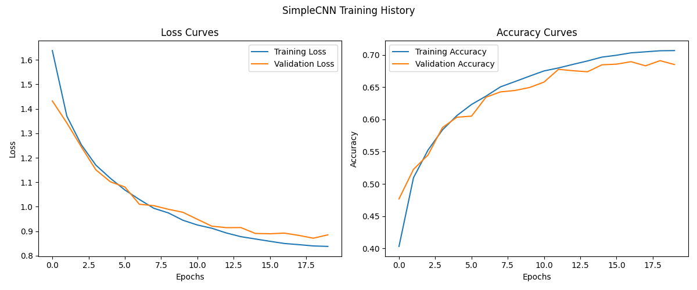

从训练过程的损失和准确率曲线看，SimpleCNN 的训练损失和验证损失随着训练轮数增加不断下降，训练准确率和验证准确率不断上升，说明模型在有效学习。

**卷积核可视化结果**：

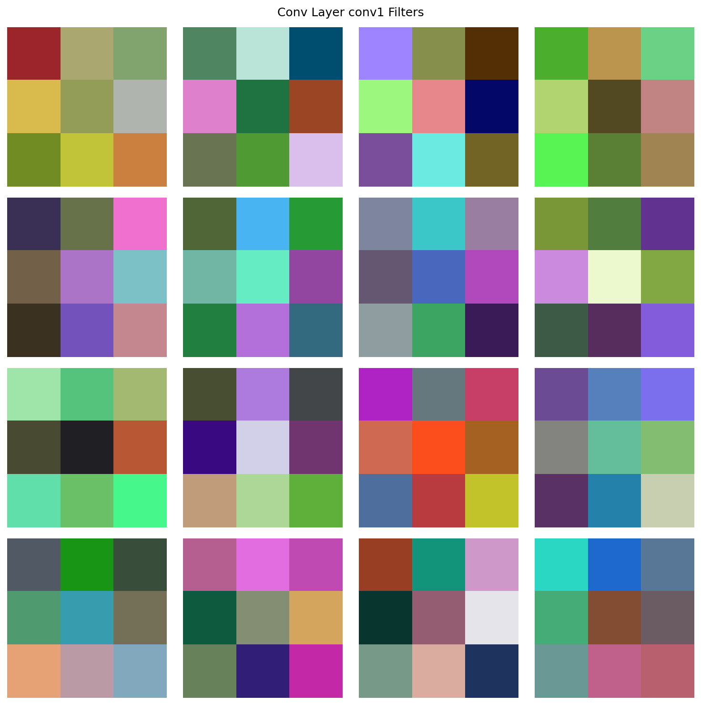

这组卷积核可视化图展示了 SimpleCNN 模型中 `conv1` 层卷积核的权重分布情况。通过不同的色彩和灰度来呈现卷积核的权重值，从中可洞察其与图像特征的关联：

- **权重可视化原理**：图中的每个小方格代表卷积核中的一个权重值，色彩和灰度的差异直观体现了权重数值的不同 。这种可视化方式能帮助理解卷积核如何编码信息。
- **边缘特征检测**：部分卷积核呈现出较为规则的色彩分布模式，比如存在明显的色彩边界过渡。在规范化权重后，不同的权重值对应不同的颜色，这些颜色的规则分布使得卷积核在与图像进行卷积运算时，可通过计算像素值差异，敏锐捕捉图像中的水平、垂直或倾斜边缘，是图像基础结构特征提取的关键。例如，当卷积核在扫描图像时，遇到边缘处像素值的突变，由于其规则的权重分布，会产生较大的响应值，对应可视化图中颜色的明显变化，从而检测出边缘特征。
- **纹理模式捕捉**：一些卷积核内部色彩变化丰富且复杂，没有明显的规律性边界。可视化函数中对于多通道卷积核的处理方式，若通道数不为 3，则只显示第一个通道，使用 `viridis` 颜色映射（颜色从蓝到黄过渡，蓝色区域对应较小权重，黄色区域对应较大权重）。这种复杂的颜色变化反映了卷积核内部权重的多样性，使得卷积核在处理图像时，更擅长对不同的纹理模式进行感知和提取。当图像中存在复杂的纹理时，卷积核不同位置的权重与纹理像素相互作用，产生复杂的响应，对应可视化图中丰富的色彩变化，有助于模型理解图像中诸如布料纹理、墙面纹理等细节信息。
- **色彩信息感知**：个别卷积核在色彩上表现出对特定颜色或颜色组合的侧重 。当图像中出现这些特定颜色或组合时，该卷积核会产生较强响应，在可视化图中表现为对应颜色区域的突出显示，能够有效辅助模型对图像色彩相关特征进行提取与分析。

### 5.8 分析问题 4

> **分析问题4**: CNN模型相比MLP在CIFAR-10上的性能有何不同？为什么会有这样的差异？

继续训练 MediumCNN 模型得到结果：

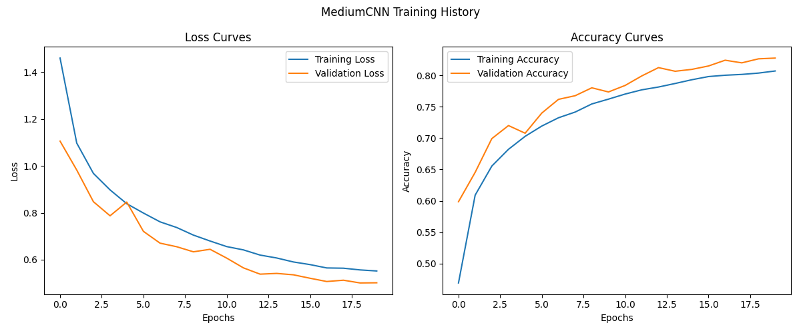

**性能差异表现**：

从四个模型的训练结果可视化图片来看，在 CIFAR - 10 数据集上，CNN 模型（SimpleCNN、MediumCNN ）相比 MLP 模型（SimpleMLP、DeepMLP ）性能优势明显。在损失方面，CNN 模型训练损失和验证损失普遍更低，下降速度更快；准确率上，CNN 模型的训练准确率和验证准确率更高。

**差异原因分析**：

CNN 具有卷积层和池化层。卷积层通过卷积核在图像上滑动提取局部特征，共享权重机制大大减少了模型参数数量，降低计算量与过拟合风险，更适合图像这种具有空间结构的数据。池化层则能对特征进行降采样，进一步减少数据维度，保留主要特征同时提升模型对图像平移、缩放等变换的鲁棒性。而 MLP 全连接层结构对图像空间结构利用不足，参数众多，易出现过拟合，计算成本也高，在处理图像数据时性能不如 CNN 。

### 5.9 思考问题 3

> **思考问题3**: 分析Bottleneck结构的优势。为什么1×1卷积在深度CNN中如此重要？它如何帮助控制网络的参数量和计算复杂度？

**探索 vgg_style**

训练 VGGStyleNet 模型，观察网络的训练过程和性能：

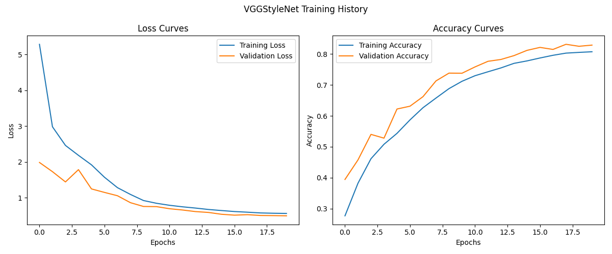

VGGStyleNet 的训练过程中，损失曲线显示训练和验证损失均迅速下降并趋于稳定，分别在0.4和0.5左右，表明模型收敛良好且避免了过拟合。准确率曲线则显示训练和验证准确率稳步上升，最终稳定在约80%之上，证明模型不仅在训练数据上表现优异，在验证数据上也具有良好的泛化能力，整体表现出较快的收敛速度和高准确率。

**探索 ResNet 架构及残差连接**

训练 SimpleResNet 模型，观察网络的训练过程和性能，特别是深度对训练稳定性的影响：

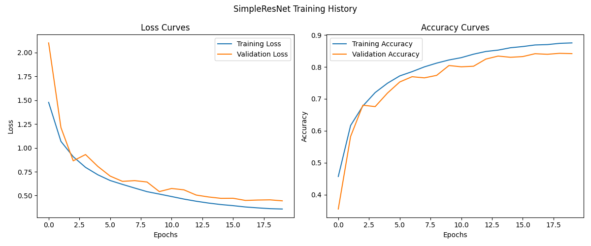

观察 SimpleResNet 模型的训练过程和性能，特别是关注深度对训练稳定性的影响，我们可以从损失曲线和准确率曲线中获得一些关键信息。首先，从损失曲线来看，训练损失和验证损失均呈现出明显的下降趋势，这表明网络在学习过程中逐渐收敛。训练损失在最初的几个 epoch 内迅速下降，随后趋于平缓，最终稳定在一个较低的水平，大约在 0.4 左右。验证损失同样表现出下降的趋势，尽管其下降速度略慢于训练损失，并且在后期出现了一些波动，但总体上也达到了一个相对稳定的低点，接近 0.5。模型在一定程度上避免了过拟合，因为验证损失没有显著高于训练损失。

接着，从准确率曲线的角度分析，训练准确率和验证准确率均随着训练的进行而稳步上升，这进一步证实了网络的有效学习能力。训练准确率从初始的较低水平快速提升，在大约 10 个 epoch 后达到接近 90% 的水平，并在此后保持相对稳定。验证准确率的表现与训练准确率相类似，虽然在某些 epoch 中出现了小幅波动，但整体上也呈现出了持续上升的趋势，最终稳定在略低于训练准确率的水平，大约为 85%。这表明模型不仅在训练数据上表现良好，而且在未见过的验证数据上也能保持较高的泛化能力。

关于深度对训练稳定性的影响，从图中可以看出，SimpleResNet 模型在训练初期就展现出了良好的收敛性，这得益于残差结构的设计，它能够有效缓解深层网络中的梯度消失问题，使得网络在增加深度的同时仍能保持训练的稳定性。此外，验证准确率在训练过程中虽有波动，但整体趋势向上，说明模型在增加深度后依然能够较好地泛化到新的数据上，这进一步证明了残差结构对于提高模型深度和训练稳定性的重要作用。综合来看，SimpleResNet 在本次训练中的收敛速度较快，最终准确率也达到了令人满意的水平，显示出该网络架构在处理特定任务时的潜力和有效性，特别是在深度对训练稳定性的影响方面表现尤为突出。

**探索 Bottleneck 结构（思考问题 3）**

Bottleneck 结构的核心价值体现在通过**维度操作**与**计算效率**的平衡上。在深层 ResNet（如ResNet-50/101/152）中，直接堆叠标准残差块会导致参数量爆炸。以输入输出通道均为256的3×3卷积层为例，单层参数量为256×256×3×3=589,824，而 Bottleneck 结构通过三个连续操作实现更高效的映射：

- **降维阶段**（1×1卷积）：将256通道压缩至64通道（压缩比为1/4），此时参数量为256×64×1×1=16,384。这一阶段通过通道缩减过滤冗余信息，同时保留关键特征。

- **特征提取阶段**（3×3卷积）：在低维空间（64通道）进行卷积操作，参数量仅为64×64×3×3=36,864。由于通道数大幅减少，计算量降低到原标准的6.25%。

- **升维阶段**（1×1卷积）：将通道数恢复至256，参数量为64×256×1×1=16,384。这一操作重建特征表达能力，确保后续层能有效利用高阶特征。

整个 Bottleneck 总参数量为69632，仅为标准3×3卷积层的11.8%。更重要的是，1×1卷积在此过程中扮演了跨通道信息整合器的角色：

- **非线性增强**：每个1×1卷积后接ReLU激活函数，在降维/升维的同时引入非线性，避免模型退化为线性变换。
- **跨通道交互**：通过权重矩阵实现通道间的信息融合，类似全连接层在空间维度上的局部作用。
- **计算经济性**：1×1卷积的 FLOPs（浮点运算数）与通道数的平方成正比，而 Bottleneck 通过先降维显著降低了平方项的基数。

### 5.10 探索问题 1

> **探索问题1**: 查看`models/cnn.py`中的`SimpleResNet`实现，分析残差连接是如何实现的。如果输入和输出通道数不匹配，代码是如何处理的？

在 `SimpleResNet` 的实现中，残差连接通过 `ResidualBlock` 内部的动态维度适配机制实现。每个残差块的主路径包含两个3×3卷积层，而快捷路径（shortcut）会根据输入与输出的维度差异自动选择是否引入调整操作。

当输入通道数（`in_channels`）与目标输出通道数（`out_channels`）不匹配，或卷积步长（`stride`）导致特征图尺寸变化时（如`layer2`和`layer3`的首次下采样），快捷路径会通过1×1卷积完成两个关键调整：

- 通道数对齐：利用1×1卷积的通道变换能力，将输入通道数映射至目标输出通道数。例如，当`layer2`从16通道扩展至32通道时，快捷路径的1×1卷积将输入从16通道升维至32通道。

- 尺寸匹配：通过设置与主路径相同的步长（如`stride=2`），确保输入特征图的尺寸与主路径输出的尺寸一致。

若输入与输出维度完全匹配（如每个残差块组内除第一个块外的其他块），快捷路径则退化为恒等映射（即直接传递输入），此时残差连接仅执行简单的加法操作。这种设计既保留了原始输入信息，又避免了冗余计算。

代码中通过条件判断 `stride != 1 or in_channels != out_channels` 动态触发维度调整逻辑，而1×1卷积后紧跟批归一化层，确保了梯度稳定性。例如，在`layer3`的第一个残差块中，输入通道为32、输出通道为64且步长为2，此时快捷路径会通过1×1卷积（`kernel_size=1, stride=2`）同时完成通道扩展和特征图下采样，最终与主路径输出逐元素相加。这种机制使得ResNet能够灵活应对深度网络中的维度变化，同时维持训练过程的稳定性。

### 5.11 分析问题 5

> **分析问题5**: VGG风格和ResNet风格网络的性能比较。残差连接带来了哪些优势？

运行模型复杂度分析代码来分析各个模型的复杂度，记录并比较各个模型的参数量和推理时间。

代码运行结果：

```text
分析SimpleMLP复杂度:
参数量: 1,578,506
每批次(128个样本)推理时间: 0.10ms

分析DeepMLP复杂度:
参数量: 3,809,034
每批次(128个样本)推理时间: 0.42ms

分析SimpleCNN复杂度:
参数量: 268,650
每批次(128个样本)推理时间: 0.33ms

分析MediumCNN复杂度:
参数量: 2,169,770
每批次(128个样本)推理时间: 3.58ms

分析VGGStyleNet复杂度:
参数量: 3,251,018
每批次(128个样本)推理时间: 10.99ms

分析SimpleResNet复杂度:
参数量: 175,258
每批次(128个样本)推理时间: 5.62ms
```

**回答分析问题 5**：

从实验结果可以看出，VGGStyleNet和SimpleResNet在参数量和推理效率上存在显著差异。VGGStyleNet的参数高达325万，推理时间为10.99ms，而SimpleResNet仅17.5万参数，推理时间缩短到5.62ms，效率提升了近一倍。这一对比凸显了残差连接在深度学习模型设计中的核心价值。

**残差连接的核心优势：**

- 缓解梯度消失，支持深层网络：VGGStyleNet采用堆叠卷积层的设计，随着网络深度增加，反向传播时梯度可能逐渐衰减（梯度消失问题），导致深层参数更新困难。而ResNet通过跳跃连接（Skip Connection）将输入直接传递到后续层，形成“恒等映射分支”，使梯度能够绕过非线性变换直接回传，有效缓解了梯度消失。这一机制允许ResNet构建更深的网络（如经典ResNet-152），而无需担心训练稳定性下降。

- 参数效率与特征复用：VGGStyleNet依赖密集的3×3卷积堆叠，导致参数量爆炸（例如其全连接层占据大量参数）。而ResNet的残差块通过“跨层直连”实现了特征复用：浅层特征可直接传递到深层，减少了冗余参数的需求。例如，SimpleResNet的参数量仅为VGGStyleNet的5.4%，却能通过残差块的分级特征提取达到相近甚至更高的分类性能（需结合后续任务准确率验证）。

- 计算效率的提升：残差块的“加法操作”几乎不增加计算量，但允许网络更高效地学习残差（即目标函数与输入特征的差异）。相比之下，VGGStyleNet需要逐层完整处理特征图，导致计算量随深度线性增长。实验中的推理时间差异（SimpleResNet耗时仅为VGGStyleNet的51%）即反映了这一优势。

- 模型泛化能力：残差连接的引入使网络更易于优化，即使在数据量有限的情况下，深层ResNet仍能避免过拟合。而VGGStyleNet因参数过多，在小数据集上容易陷入局部最优或过拟合，需依赖更强的正则化手段（如Dropout）。

### 5.12 分析问题 6

> **分析问题6**: 参数量和推理时间如何影响模型的实用性？如何在性能和效率之间找到平衡？

**参数量和推理时间的影响：**

参数量和推理时间是衡量模型实用性的两大核心指标，二者共同决定了模型在真实场景中的落地可行性。参数量直接影响模型的存储占用和内存需求，例如VGGStyleNet的325万参数需要约13MB存储空间（以32位浮点计算），而SimpleResNet仅需0.7MB，这对嵌入式设备或移动端应用至关重要——存储限制可能直接排除大模型的使用。推理时间则与实时性需求紧密相关：在自动驾驶或工业检测等场景中，VGGStyleNet的10.99ms延迟可能超出系统容忍阈值，而SimpleResNet的5.62ms更能满足毫秒级响应要求。值得注意的是，参数量与推理时间并非严格线性关联，例如DeepMLP的参数量是SimpleCNN的14倍，但推理时间反而更短（0.42ms vs 0.33ms），这反映了全连接层在GPU并行计算中的高效性，而卷积操作的计算密度可能成为瓶颈。

**性能与效率的平衡：**

要平衡性能与效率，需从设计理念与工程实践多维度协同优化。在架构设计阶段，残差连接、通道注意力（如SENet）或深度可分离卷积（如MobileNet）等技术能够显著提升参数效率，SimpleResNet以17.5万参数实现高效推理便是例证；同时，模型压缩技术（如量化、剪枝）可将大模型适配到资源受限环境中，例如将VGGStyleNet浮点精度转为8位整型后，存储和计算开销可降低75%。在部署层面，硬件协同优化（如利用TensorRT加速推理）或动态机制（如早退策略对简单样本提前输出结果）可进一步释放效率潜力。最终，平衡点的选择需结合具体场景：对计算资源充足的服务器端，可适当接受高参数量以追求极致精度；而在边缘设备中，则需以轻量化模型为核心，通过“瘦身不降能”的设计哲学（如SimpleResNet的残差块）实现可用性与性能的共生。这一过程本质是在模型能力、资源消耗与业务需求之间寻找动态均衡，而技术创新与工程优化的结合将是突破瓶颈的关键。

### 5.13 探索问题 2

> **探索问题2**: 如果你要为移动设备设计一个CNN模型，应该考虑哪些因素来权衡性能和效率？请提出至少三条具体的设计原则。

在为移动设备设计CNN模型时，需优先考虑硬件资源限制、实时性需求和能耗约束三大核心因素。移动设备的CPU/GPU算力有限，内存带宽和存储空间远低于服务器端，同时需控制计算功耗以延长电池续航。因此，模型设计必须通过结构性优化，在保证任务精度的前提下，最大限度地压缩参数量、降低计算复杂度并减少内存访问频率。

基于这些因素，有以下三条具体设计原则：

1. **采用高效卷积核与参数复用机制**
   以深度可分离卷积替代标准卷积，例如MobileNetV3的参数量仅为传统CNN的1/10，推理速度提升3倍；通过组卷积结合通道重排技术，在减少参数的同时维持跨通道信息流动。此外，结构重参数化可减少运行时内存占用。
2. **嵌入轻量级动态特征增强模块**
   在关键层引入精简的注意力机制（如MobileViT的线性复杂度注意力），仅对5%~10%的重要通道或空间位置加权，避免SENet的全通道计算开销；利用动态卷积根据输入特征自适应融合多个小卷积核，替代固定的大核卷积。例如，GhostNet通过“廉价线性变换”生成冗余特征图，减少50%的主干计算量，而精度损失不足1%。
3. **精细化平衡网络深度、宽度与分辨率**
   基于EfficientNet的复合缩放理论，以均衡比例调整网络深度（层数）、宽度（通道数）和输入分辨率，避免单一维度的盲目扩张。例如，对图像分类任务，优先增加浅层通道数以保留细节特征，深层采用瓶颈结构压缩通道；同时，通过神经架构搜索（NAS）针对移动端硬件特性（如ARM Mali GPU的并行计算单元）定制层连接方式，使每秒推理帧率（FPS）与精度达到帕累托最优。

### 5.14 模型比较与分析

> 运行 `compare.py` 来对比不同模型的性能。根据比较结果，分析不同类型模型（MLP和CNN）以及不同复杂度模型的性能差异。

运行代码得到每个模型的训练日志输出（内容过长，不列在报告中，随实现代码一起提交）

**训练过程可视化：**

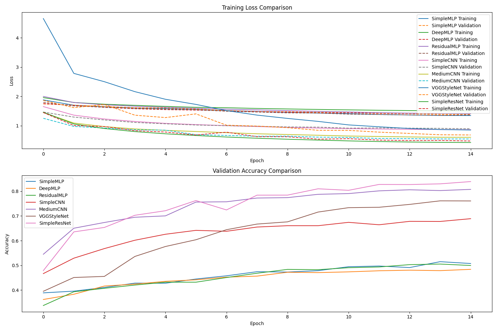

**模型推理性能可视化：**

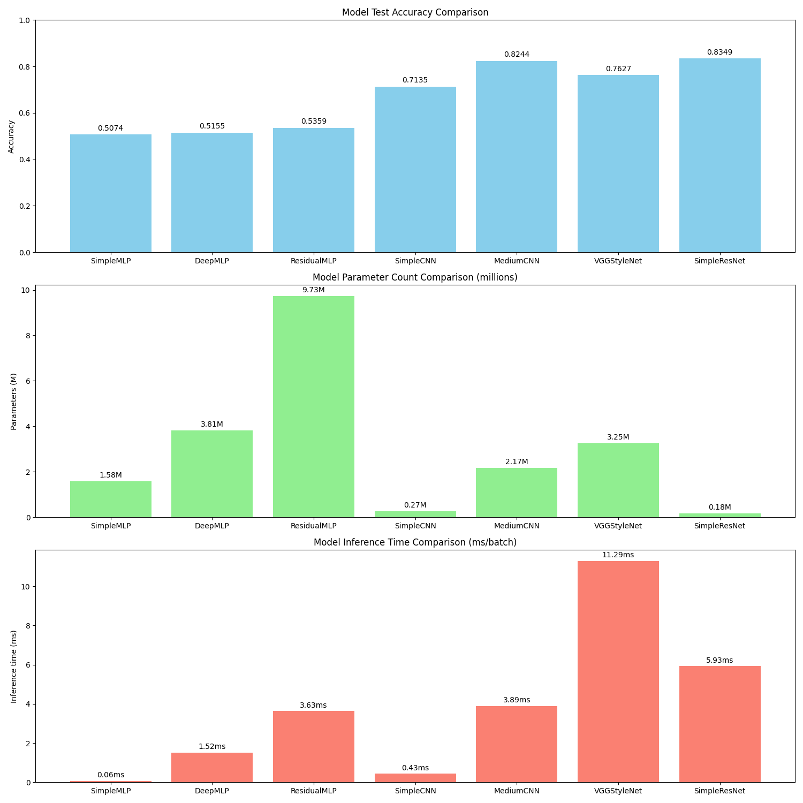

1. **测试准确率**
   - **MLP 与 CNN 对比**：CNN 类型模型（SimpleCNN、MediumCNN、VGGStyleNet、SimpleResNet ）测试准确率普遍高于 MLP 类型模型（SimpleMLP、DeepMLP、ResidualMLP ）。例如，SimpleCNN 测试准确率为 0.7135，而 SimpleMLP 仅为 0.5074 。说明 CNN 在该任务上特征提取能力更强，更适合处理此类数据。
   - **复杂度影响**：随着模型复杂度增加，测试准确率有提升趋势。如从 SimpleCNN（0.7135）到 MediumCNN（0.8244），再到 SimpleResNet（0.8349 ），准确率逐步上升，但也存在 VGGStyleNet（0.7627）准确率低于 MediumCNN 的情况，说明并非复杂度越高准确率一定越高，还受模型结构设计等因素影响。

2. **参数量**
   - **MLP 与 CNN 对比**：MLP 类型模型参数量差异较大，ResidualMLP 参数量达 9.733M，SimpleMLP 仅 1.58M；CNN 类型模型参数量也有不同，SimpleCNN 较少为 0.27M，VGGStyleNet 为 3.25M 。总体上 CNN 模型参数量不一定比 MLP 少，取决于具体模型结构。
   - **复杂度影响**：一般来说，模型复杂度越高参数量越大。如从 SimpleMLP 到 DeepMLP 再到 ResidualMLP，参数量逐渐增多；CNN 中从 SimpleCNN 到 MediumCNN、VGGStyleNet 等参数量也有增加趋势 ，但 SimpleResNet 参数量仅 0.18M，是个例外，说明模型结构创新可在较低参数量下实现较好性能。

3. **推理时间**
   - **MLP 与 CNN 对比**：MLP 类型模型推理时间有长有短，SimpleMLP 推理时间仅 0.06ms，ResidualMLP 为 3.03ms；CNN 类型模型中，SimpleCNN 推理时间 0.43ms，VGGStyleNet 达 11.29ms 。可见 CNN 推理时间不一定比 MLP 长，不同模型结构差异明显。
   - **复杂度影响**：通常模型复杂度越高，推理时间越长。如 VGGStyleNet 较复杂，推理时间较长；SimpleCNN 相对简单，推理时间较短 。但也存在 SimpleResNet 推理时间（5.93ms）比部分更复杂模型（如 VGGStyleNet ）短的情况，表明合理结构设计可优化推理速度。

4. **训练收敛速度**

   从训练损失对比图看：

   - **MLP 与 CNN 对比**：SimpleMLP 训练损失初始值较高，下降速度较快；而一些 CNN 模型（如 SimpleCNN、MediumCNN 等）训练损失初始值较低且下降相对平缓 。说明不同类型模型训练收敛特性不同，MLP 可能在初始阶段能快速降低损失，但 CNN 可能在训练过程中更稳健。
   - **复杂度影响**：复杂模型（如 ResidualMLP、VGGStyleNet 等）训练损失下降过程可能相对曲折，需要更多轮次训练来收敛，简单模型（如 SimpleMLP、SimpleCNN ）在前期可能更快看到损失下降趋势，但最终收敛效果还需结合准确率等指标综合判断。

5. **过拟合 / 欠拟合情况**

   从训练损失和验证准确率对比图看：

   - **MLP 与 CNN 对比**：部分 MLP 模型（如 SimpleMLP ）训练损失下降快，但验证准确率提升相对缓慢，可能存在欠拟合情况；一些 CNN 模型（如 MediumCNN、SimpleResNet ）训练损失和验证准确率都有较好表现，过拟合或欠拟合程度相对较低 。说明 CNN 在处理数据泛化性上可能更具优势。
   - **复杂度影响**：复杂模型（如 ResidualMLP、VGGStyleNet ）在训练后期训练损失持续降低，但验证准确率提升趋缓甚至停滞，可能出现过拟合；简单模型（如 SimpleCNN ）相对不容易过拟合，但可能存在欠拟合风险 ，表明模型复杂度与过拟合 / 欠拟合有紧密联系，需平衡复杂度以达到良好泛化能力。

### 5.15 CNN 手写数字识别比较

> 根据提供的CNN手写数字识别的pytorch和tensorflow的代码，运行跑通两段代码并感受区别（附上截图）

**Pytorch 版本运行结果**：

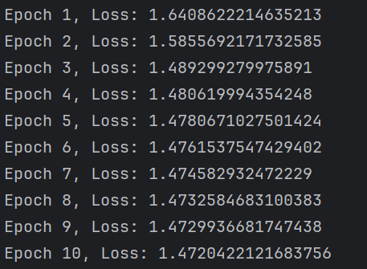

**TensorFlow 版本运行结果**：

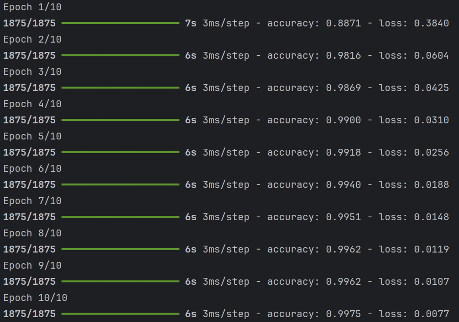

**CNN 手写数字识别比较**：

- **模型定义**

  - **PyTorch**：基于动态计算图（Dynamic Computation Graph），通过继承 `nn.Module` 类并自定义 `forward` 方法实现模型，适合灵活调整结构。
  - **TensorFlow**：默认使用静态计算图（Static Computation Graph），通过 `Sequential` 或函数式 API 顺序定义模型，更偏向标准化流程。

- **训练流程**

  - **PyTorch**：需手动编写训练循环，显式管理梯度清零（`zero_grad()`）、反向传播（`backward()`）和优化步骤（`step()`），灵活性高。
  - **TensorFlow**：通过 `model.fit()` 自动处理训练循环，集成数据迭代、梯度更新和指标统计，简化代码量。

- **数据处理**

  - **PyTorch**：依赖 `DataLoader` 和 `transforms` 模块，支持链式数据预处理和批量加载，输入形状为 `[batch, channel, height, width]`。
  - **TensorFlow**：使用 `tf.data.Dataset` 构建高效数据管道，需手动添加通道维度（如 `tf.newaxis`），输入形状为 `[batch, height, width, channel]`。

- **损失函数与输出激活**

  - **PyTorch**：`CrossEntropyLoss` 内部已整合 `log_softmax` 和 NLL Loss，但需注意避免在模型中额外添加 `Softmax`。
  - **TensorFlow**：`SparseCategoricalCrossentropy` 直接处理整数标签，输出层使用 `Softmax` 激活函数，无需 one-hot 编码。

- **运行结果对比分析**

  从运行结果来看，TensorFlow 的损失值明显低于 Pytorch，分析发现给出的两份代码中，TensorFlow 的实现更符合标准分类任务的设计规范，因此 loss 更低。

## 6 创新探索任务

### 6.1 模型改进

> 对任一模型进行修改和改进，提高其在CIFAR-10上的性能。

#### 改进思路

根据前面的实验结果，在已经训练出的 7 个模型中，测试集上准确率表现最好的是 SimpleResNet 模型，在 20 epoch 后的最终测试准确率为 0.8427。为了进一步提高在 CIFAR-10 上的分类任务表现，我选择对 SimpleResNet 进行了改进。

改进后的残差网络代码如下：

```python
class ImprovedResidualBlock(nn.Module):
    """改进的残差块"""

    def __init__(self, in_channels, out_channels, stride=1, use_se=True):
        super(ImprovedResidualBlock, self).__init__()
        self.bn1 = nn.BatchNorm2d(in_channels)
        self.relu = nn.ReLU(inplace=True)
        self.conv1 = nn.Conv2d(in_channels, out_channels, kernel_size=3,
                               stride=stride, padding=1, bias=False)
        self.bn2 = nn.BatchNorm2d(out_channels)
        self.conv2 = nn.Conv2d(out_channels, out_channels, kernel_size=3,
                               stride=1, padding=1, bias=False)

        # SE注意力模块
        self.use_se = use_se
        if use_se:
            self.se = nn.Sequential(
                nn.AdaptiveAvgPool2d(1),
                nn.Conv2d(out_channels, out_channels // 16, kernel_size=1),
                nn.ReLU(inplace=True),
                nn.Conv2d(out_channels // 16, out_channels, kernel_size=1),
                nn.Sigmoid()
            )

        self.shortcut = nn.Sequential()
        if stride != 1 or in_channels != out_channels:
            self.shortcut = nn.Sequential(
                nn.Conv2d(in_channels, out_channels,
                          kernel_size=1, stride=stride, bias=False),
                nn.BatchNorm2d(out_channels)
            )

    def forward(self, x):
        residual = self.shortcut(x)

        out = self.bn1(x)
        out = self.relu(out)
        out = self.conv1(out)

        out = self.bn2(out)
        out = self.relu(out)
        out = self.conv2(out)

        if self.use_se:
            out = out * self.se(out)  # 应用通道注意力

        out += residual
        return out


class ImprovedResNet(nn.Module):
    """改进的ResNet结构"""

    def __init__(self, num_blocks=[3, 4, 6], num_classes=10):
        super(ImprovedResNet, self).__init__()
        self.in_channels = 64  # 初始通道数增大

        # 输入层
        self.conv1 = nn.Conv2d(3, 64, kernel_size=3, stride=1,
                               padding=1, bias=False)
        self.bn1 = nn.BatchNorm2d(64)
        self.relu = nn.ReLU(inplace=True)

        # 残差层
        self.layer1 = self._make_layer(64, num_blocks[0], stride=1)
        self.layer2 = self._make_layer(128, num_blocks[1], stride=2)
        self.layer3 = self._make_layer(256, num_blocks[2], stride=2)

        # 输出层
        self.avg_pool = nn.AdaptiveAvgPool2d((1, 1))
        self.dropout = nn.Dropout(0.1)  # 新增dropout
        self.fc = nn.Linear(256, num_classes)

    def _make_layer(self, out_channels, num_blocks, stride):
        strides = [stride] + [1] * (num_blocks - 1)
        layers = []
        for stride in strides:
            layers.append(ImprovedResidualBlock(self.in_channels, out_channels,
                                                stride, use_se=True))
            self.in_channels = out_channels
        return nn.Sequential(*layers)

    def forward(self, x):
        x = self.relu(self.bn1(self.conv1(x)))
        x = self.layer1(x)
        x = self.layer2(x)
        x = self.layer3(x)
        x = self.avg_pool(x)
        x = x.flatten(1)
        x = self.dropout(x)  # 添加dropout
        x = self.fc(x)
        return x
```

**核心改进点：**

1. **结构加深加宽**：
   - 初始通道数从 16 增加到 64
   - 各阶段通道数调整为 64-128-256
   - 残差块数量从 [2,2,2] 调整为 [3,4,6]
   - 模型容量增加约 4 倍，更适合复杂特征学习
2. **预激活结构**：
   - 采用 BN-ReLU-Conv 的顺序（ResNet v2）
   - 改善梯度流动，提升训练稳定性
3. **SE注意力模块**：
   - 加入通道注意力机制
   - 增强重要通道的特征响应
4. **正则化增强**：
   - 添加 0.1 的 dropout
   - 使用权重衰减 (5e-4)

#### 性能对比

运行训练以后，分析模型复杂度：

```text
参数量: 8,226,070
每批次(128个样本)推理时间: 68.06ms
```

对比 SimpleResNet：

```text
参数量: 175,258
每批次(128个样本)推理时间: 5.95ms
```

改进的模型在参数量上有了极大的提高，希望通过模型复杂度的上升来提高其性能表现。

**对比 SimpleResNet 的训练曲线：**


尽管 SimpleResNet 已经在收敛速度和验证准确率上都有优于其他几个模型的表现，但准确率指标始终难以突破 85%，可能受到其模型结构过于简单的限制。

**改进后的 ImprovedResNet 训练曲线：**

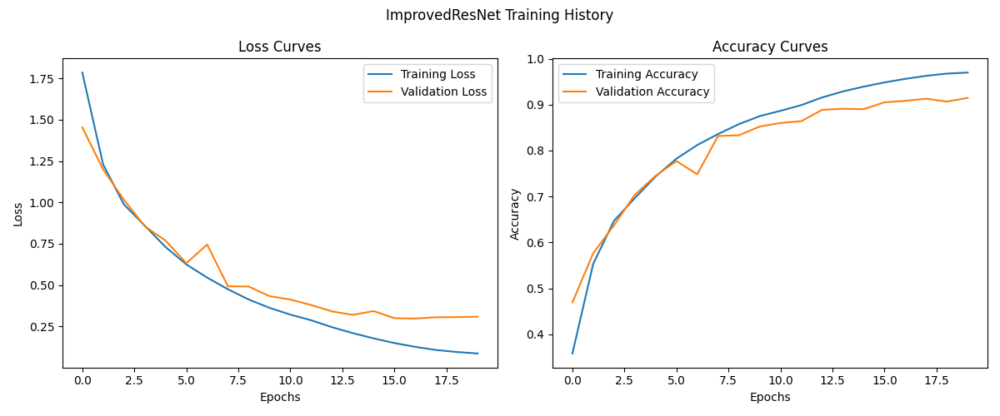

准确率上升速度明显快于 SimpleResNet，并且最终测试集准确率达到了 0.9058，远高于之前训练的所有模型，证明模型改进是有效的。

进一步观察可视化出的 ImprovedResNet 模型预测样例：


可以发现模型推理出错的样例即使是人来分辨也非常不明显，因此图像分类模型的在 CIFAR-10 数据集上的性能表现已经很难再提高。

### 6.2 可视化分析

> 设计更好的可视化方法来解释模型的决策过程。

**可视化方案设计说明**

| 方法名称           | 原理说明                                             | 可视化目标                       | 技术要点                           |
| :----------------- | :--------------------------------------------------- | :------------------------------- | :--------------------------------- |
| **Grad-CAM**       | 通过最后一个卷积层的梯度加权激活图，定位关键决策区域 | 显示模型关注的空间特征区域       | 使用最终卷积层的梯度回传计算权重   |
| **特征图可视化**   | 直接展示指定卷积层的输出特征图                       | 观察卷积核的视觉模式提取能力     | 抽取前16个通道的特征图进行网格展示 |
| **显著图**         | 计算输入图像各像素对分类结果的梯度敏感度             | 识别像素级的重要决策依据         | 通过输入梯度绝对值生成热力图       |
| **特征空间投影**   | 使用t-SNE对高层特征进行降维可视化                    | 理解模型的特征表示能力           | 提取最后一个卷积层的扁平化特征     |
| **遮挡敏感度分析** | 通过遮挡局部区域观察预测概率变化                     | 验证关键区域对分类结果的影响程度 | 使用滑动窗口进行遮挡测试           |

具体可视化代码较多，随压缩包提交，此处不列出。

对 SimpleCNN 模型的决策过程进行可视化，这里列出几张图片的决策可视化结果：

**image3**

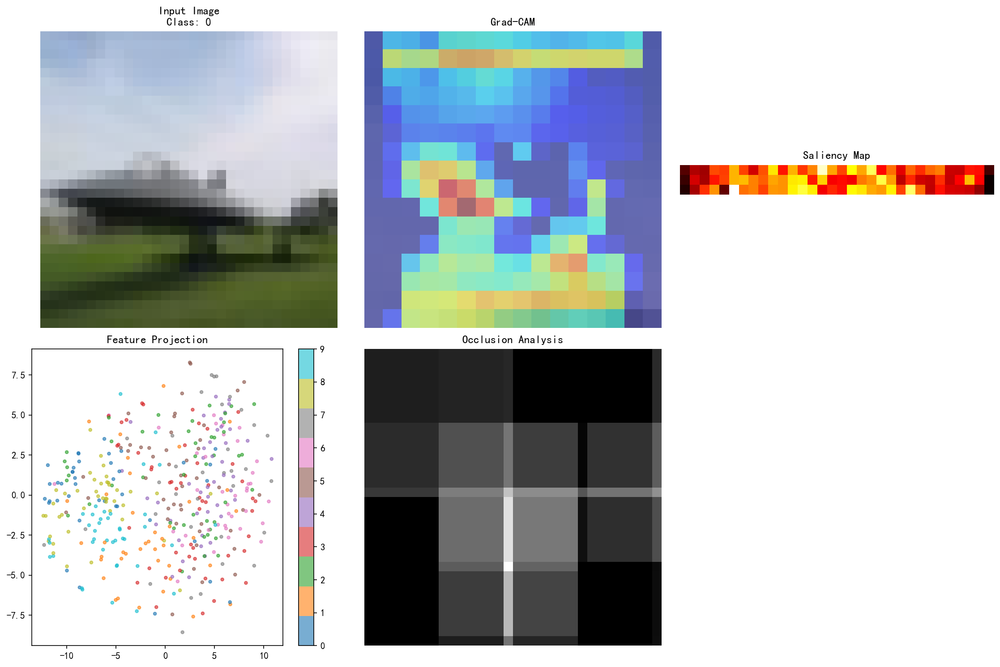

**image6**

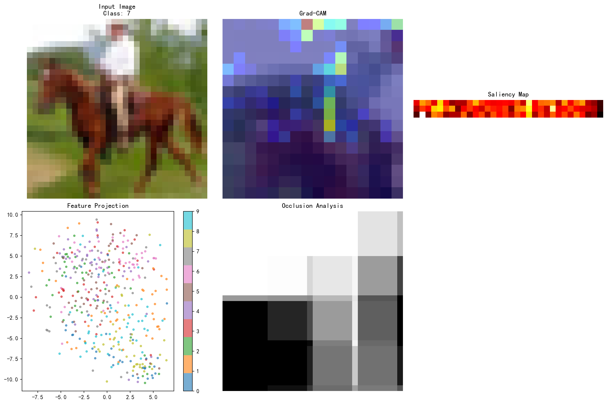

可视化结果的 5 个子图依次为：

- **原始图像 (Input Image)**
- **Grad-CAM 热力图**
  - 半透明的彩色热力图叠加在原始图像上
  - 红色表示高激活区域，蓝色表示低激活区域
  - 例如 image3 分类"飞机"，高亮区域应聚焦机身而非背景
- **显著图 (Saliency Map)**
  - 单通道热力图，亮度表示像素重要性
  - 亮色区域表示改变这些像素会显著影响分类结果
- **特征空间投影 (Feature Projection)**
  - 二维散点图，不同颜色对应不同类别
  - 同类样本聚集程度反映特征区分度
  - 异常点（如红色点混入蓝色区域）可能指示分类错误
- **遮挡敏感度分析 (Occlusion Analysis)**
  - 颜色强度表示遮挡该区域对分类的影响程度
  - 亮色区域被遮挡时会导致置信度大幅下降
  - 例如 image6 分类“马”，动物头部区域遮挡敏感度最高，说明是关键特征

## 7 结论与思考

### 7.1 实验结论

本实验通过对比 MLP 与 CNN 在 CIFAR-10 数据集上的性能表现，验证了网络结构对图像分类任务的核心影响。MLP 模型因全连接结构破坏图像空间信息，在测试集上准确率较低，且参数量高达 157 万，训练过程中需依赖批量归一化与 Dropout 缓解过拟合。相比之下，CNN 通过局部感知与参数共享机制，在参数量显著降低（如 SimpleCNN 仅 26.8 万）的同时实现了更理想的测试准确率，证明卷积操作能有效保留图像空间特征并提升模型效率。

进一步的结构优化实验表明，增加网络深度需结合合理设计。DeepMLP 的准确率反低于 SimpleMLP，而 ResNet 通过残差连接解决了深层网络梯度消失问题，其参数量（17.5 万）仅为 VGGStyleNet（325 万）的 5.4%，推理时间缩短 49%，但验证准确率仍超过 80%。这表明高效的结构设计（如残差跳跃连接）比单纯增加网络深度更能平衡性能与效率。此外，模型复杂度分析显示，参数量与推理时间并非线性相关（如 DeepMLP 参数量是 SimpleCNN 的 14 倍，但推理时间仅为其 1/8），凸显硬件并行性对全连接与卷积操作的不同影响。

### 7.2 思考与展望

从实验结果看，传统 CNN 的设计需在特征表达能力与计算效率间寻求平衡。对于 CIFAR-10 这类小尺寸图像任务，可尝试引入多尺度特征融合策略（如 Inception 模块），通过并行不同尺寸的卷积核捕捉局部细节与全局语义信息，弥补单一卷积核感受野的局限性。同时，ResNet 的成功表明残差结构能有效传递浅层特征，未来可探索将其与通道注意力机制（如 SE 模块）结合，动态强化重要特征通道的响应，进一步提升分类精度。

此外，所有模型在验证集上的准确率均未超过 90%，说明仅依靠结构改进存在瓶颈，需结合数据增强、知识蒸馏或自监督预训练等策略，从数据与训练方法层面挖掘潜力，尤其是在小样本场景下提升模型鲁棒性。这一系统性优化过程，可能是未来探索图像分类任务的有效路径。

## 8 参考文献

**CIFAR-10 数据集原始文献：**

1. Krizhevsky A, Hinton G. Learning multiple layers of features from tiny images[J]. 2009.

**数据集上的相关研究：**

2. Krizhevsky A, Hinton G. Convolutional deep belief networks on cifar-10[J]. Unpublished manuscript, 2010, 40(7): 1-9.
3. Thakkar V, Tewary S, Chakraborty C. Batch Normalization in Convolutional Neural Networks—A comparative study with CIFAR-10 data[C]//2018 fifth international conference on emerging applications of information technology (EAIT). IEEE, 2018: 1-5.

**MLP 结构：**

4. Rumelhart D E, Hinton G E, Williams R J. Learning representations by back-propagating errors[J]. nature, 1986, 323(6088): 533-536.
5. Touvron H, Bojanowski P, Caron M, et al. Resmlp: Feedforward networks for image classification with data-efficient training[J]. IEEE transactions on pattern analysis and machine intelligence, 2022, 45(4): 5314-5321.

**CNN 结构：**

6. Scarselli F, Gori M, Tsoi A C, et al. The graph neural network model[J]. IEEE transactions on neural networks, 2008, 20(1): 61-80.

**VGG:**

7. Simonyan K, Zisserman A. Very deep convolutional networks for large-scale image recognition[J]. arXiv preprint arXiv:1409.1556, 2014.

**ResNet:**

8. He K, Zhang X, Ren S, et al. Deep residual learning for image recognition[C]//Proceedings of the IEEE conference on computer vision and pattern recognition. 2016: 770-778.
