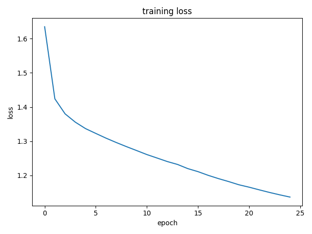
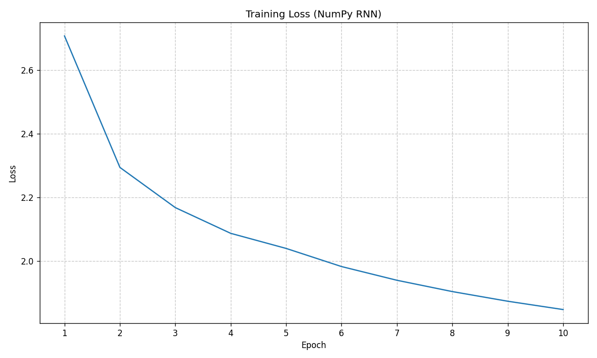
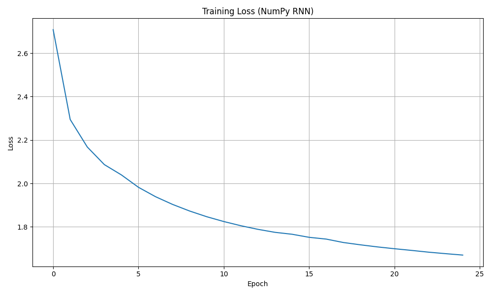

# Lab6 实验报告

------

[TOC]

------

## 1. 实验目标与知识点

| 目标                   | 关键点                                      |
| ---------------------- | ------------------------------------------- |
| 掌握 RNN/LSTM 理论     | 递归公式、BPTT、梯度爆炸/消失现象及缓解策略 |
| 熟悉字符级语言模型     | one-hot/embedding、交叉熵损失、温度采样     |
| 独立手写 RNN           | 前向 + BPTT + 参数更新全过程                |
| 提升调参与实验报告能力 | 曲线可视化、案例分析、批评性思考            |

------

## 2. 原理回顾

### 2.1 Vanilla RNN 数学形式

$$h_t = \tanh( W_{xh} x_t + W_{hh} h_{t-1} + b_h )$$

$$\hat y_t = \mathrm{softmax}( W_{hy} h_t + b_y )$$

- **循环依赖**：$h_t$ 同时依赖当前输入 $x_t$ 与前一时刻隐藏状态 $h_{t-1}$。
- **参数共享**：所有时间步使用同一组权重，实现序列长度不定的建模。

### 2.2 反向传播 Through Time（BPTT）

- **展开计算图**：将序列视为深度 = $T$ 的前馈网络。
- **梯度公式**（链式法则）：

$$
\frac{\partial\mathcal L}{\partial W_{hh}} = \sum_{t=1}^T \delta_t\, h_{t-1}^T, \qquad
\delta_t = \bigl( W_{hh}^T\,\delta_{t+1} + W_{hy}^T (\hat y_t - y_t) \bigr) \odot (1-h_t^2)
$$

其中 $\odot$ 为 Hadamard 乘。

- **梯度爆炸/消失**：当 $|W_{hh}|*2 \gg 1$ 时梯度指数级爆炸；当 $|W*{hh}|_2 \ll 1$ 时迅速衰减。
- **缓解方法**：
  1. 梯度裁剪（本实验中 `--clip`）。
  2. 门控单元（LSTM/GRU）。

### 2.3 LSTM 门控机制

- LSTM 通过 **输入门** $i_t$、**遗忘门** $f_t$、**输出门** $o_t$ 与 **候选记忆** $\tilde c_t$ 控制信息流：

  $$i_t = \sigma\!\bigl(W_{xi}x_t + W_{hi}h_{t-1}+b_i\bigr),
  \quad f_t = \sigma(\cdot),
  \quad o_t = \sigma(\cdot)$$

  $$\tilde c_t = \tanh\!\bigl(W_{xc}x_t + W_{hc}h_{t-1}+b_c\bigr)$$

  $$c_t = f_t \odot c_{t-1} + i_t \odot \tilde c_t$$

  $$h_t = o_t \odot \tanh(c_t)$$

- **关键信号通路**：细胞状态 $c_t$ 仅受按元素乘控制，避免反复线性变换，从而 **稳定梯度**。

### 2.4 采样温度与多样性

对 softmax logits 除以温度 $T$：$P(i) \propto \exp(z_i/T)$。

- $T<1$ → 分布更尖锐，输出更确定，易重复。
- $T>1$ → 分布更平坦，文本更有创造性但也可能语法混乱。

### 2.5 实践技巧

| 问题         | 技巧                                    |
| ------------ | --------------------------------------- |
| 长序列训练慢 | 截断 BPTT：只保留最近 $k$ 步梯度        |
| 首字难预测   | 使用前缀 *seed* 引导。                  |
| 模型过拟合   | Dropout、增大语料、多层较浅替代单层巨大 |

------

## 3. 环境与数据准备


| 环境           | 版本                              |
| -------------- | --------------------------------- |
| Python         | 3.10.16                           |
| PyTorch 相关库 | `numpy matplotlib torch requests` |
| 其他库         | `logging time tqdm pickle`        |
| IDE            | PyCharm                           |

GPU 用于加速 PyTorch 实验，配置了 CUDA 12.3

------

## 4. 实验内容及结果分析
**完整实现了 4.1 A 和 4.2 B**

### 4.1 A — PyTorch 高阶版

1. **运行 baseline。**

   为了直观显示训练过程并记录结果，我对 `rnn_experiment_framework.py` 代码进行了适应性调整，主要包括确保日志系统 (`logging`) 和进度条 (`tqdm`) 能够正确运行并输出信息。随后，在本地配置的PyTorch环境中（Python 3.10.16, PyTorch with CUDA 12.3）执行了训练脚本。训练完成后，成功生成了模型文件 (`char_lstm.pth`)，训练过程中的损失变化被记录并绘制成Loss曲线图，同时所有训练步骤和信息也通过`logging`保存到了日志文件中。

2. **原理提醒：关注 `Embedding` 的作用 —— 将 one-hot 稀疏向量映射到稠密语义空间；这相当于学习字符级“词向量”。**

   在本次实验的PyTorch代码中，`nn.Embedding` 层扮演了关键角色。字符首先被转换为整数索引，然后`Embedding`层将这些离散的、高维的one-hot形式的字符索引映射到一个更低维、稠密的向量空间中。这个稠密向量可以被认为是字符的“词向量”，它能够捕捉字符间的语义相似性。例如，“a”和“e”可能比“a”和“z”在向量空间中更接近。这种稠密表示相比one-hot编码，能更有效地被后续的LSTM层处理，因为它提供了更丰富、更平滑的输入特征，有助于模型学习字符间的复杂关系和上下文信息。

3. **观察损失曲线：与理论中交叉熵 $\mathcal L=-\sum y\log\hat y$ 对应。**

   

   上图展示了模型在训练过程中的损失变化情况。横轴代表训练的epoch（轮次），纵轴代表每个epoch结束时计算得到的平均训练损失（具体为交叉熵损失）。 从图中可以看出：

   - 初始阶段（Epoch 0-2）： 损失值从一个较高的初始值（约1.65）迅速下降到约1.4以下。这表明模型在训练初期学习速度非常快，权重通过反向传播和优化器（AdamW）的调整，迅速找到了一个能较好拟合训练数据的方向。
   - 中期阶段（Epoch 2-15）： 损失值的下降速度逐渐减缓，但仍然保持稳步下降的趋势，从约1.4降低到1.2左右。这说明模型在进一步微调其参数，学习更细致的语言模式。
   - 后期阶段（Epoch 15-25）： 损失值的下降变得更加平缓，在最后几个epoch，曲线趋于平稳，最终达到约1.13左右。这可能意味着模型逐渐接近其在当前配置和数据集下的性能极限，或者学习率需要进一步调整以获得更细微的改进。 整个曲线的形态符合典型的机器学习模型训练过程：初始快速学习，随后学习速度放缓，最终趋于收敛。该损失是通过`nn.CrossEntropyLoss()`计算得出的，这与理论中字符级语言模型常用的交叉熵损失函数 $\mathcal L=−\sum y_i \log \hat y_i$ (其中 $y_i$ 是真实下一字符的 one-hot 编码，$\hat y_i$ 是模型预测的下一字符的概率分布) 的目标是一致的。

4. **改写 `train()` 引入 `torch.nn.utils.clip_grad_norm_` 的 阈值对梯度爆炸的抑制。**

   在提供的 `rnn_experiment_framework.py` 文件的 `train` 函数中，已经包含了梯度裁剪的实现。具体代码如下：

   ```python
   # optim.zero_grad() # 梯度清零
   # out, hidden = model(x, hidden) # 前向传播
   # ...
   # loss.backward() # 反向传播计算梯度
   nn.utils.clip_grad_norm_(model.parameters(), clip) # 梯度裁剪
   # optim.step() # 更新参数
   ```

   这行代码 `nn.utils.clip_grad_norm_(model.parameters(), clip)` 的作用是，在参数更新之前（`optim.step()`之前），检查模型所有参数的梯度范数总和。如果这个总范数超过了预设的阈值 `clip`（在实验默认参数中 `clip` 设置为5.0），那么所有参数的梯度会被按比例缩小，使得总范数恰好等于这个阈值。 这种机制有效地防止了梯度爆炸问题。梯度爆炸是指在训练深层网络或RNN时，梯度在反向传播过程中可能因为连乘效应而变得非常大，导致权重更新步子过大，使得训练过程不稳定甚至发散。通过梯度裁剪，可以将梯度限制在一个合理的范围内，保证了训练的稳定性，使得模型能够更平稳地学习。

5. **对比不同温度采样结果，回到 §2.4 解释差异。**

   根据实验指导§2.4，采样温度 T 会影响 softmax 输出的概率分布：$P(i) \propto \exp(z_i/T)$ 。当 T 较小时，概率分布更尖锐，模型倾向于选择概率最高的字符；当 T 较大时，概率分布更平坦，模型选择的多样性增加。 以下是使用训练好的模型在不同温度下生成的文本样本：

   - **Temperature 0.50:**

     ```
     ROMEO: I shall
     stay a fellow of your hearts, and as the duke is a
     good fellow. And the tribunes of the poor servant
     In the senate and the day.
     
     MERCUTIO:
     Marry, your master's bosom! I have to hear him like
     to him and the rest, and in common fight with
     this case of mine honour, the most strange fight
     of his house, the authority of the head
     of the people and the best of the face of the
     courtesy to his plea
     ```

     分析：当温度为 0.5 时，生成的文本相对保守和确定。句子结构比较连贯，用词也较为常见和可预测（例如 "good fellow", "In the senate"）。重复某些模式的倾向可能会增加，但整体上语法错误较少，文本更“安全”。这符合 $T<1$ 时概率分布更尖锐的特点，模型倾向于选择它最有信心的字符。

   - **Temperature 1.00:**

     ```
     ROMEO: Busking
     there may meet me, that seem to breathe me of;
     bad all, your way towards me! say, look to you;
     is your great puisston in your promise?
     
     LUCIO:
     This cannot all home.
     
     Shepherd:
     No, I cannot be a fair head: I'll subdound you.
     
     ISABELLA:
     Have you not find you enemies of?
     
     VOLUMNIA:
     She may be lock'd; this is use to be ten thousand.
     
     GRUMIO:
     What, as this colour think?
     
     Officer:
     John me, then:
     ```

     分析：温度为 1.0 时，是标准的 softmax 采样。生成的文本在确定性和随机性之间取得了较好的平衡。可以看到一些新颖的词语组合（如 "great puisston" 可能是拼写错误或新造词），句子结构尚可，但有时会出现一些不太通顺或略显奇怪的表达（如 "This cannot all home."）。这体现了模型在不过于保守的情况下，探索不同字符组合的能力。

   - **Temperature 1.30:**

     ```
     ROMEO: You'll tell.
     To me frame you?
     
     HERMIONE:
     O whenver should send it beloved!
     
     Nurse:
     Ay, bid'st this adage, sir, but instnuction
     To brung Lucentio Bastaries for the earth-brow'?
     Farewell: once more unvery, song hews
     To my pity; wherefore follow now!
     Take-sycome-tyrant and eacle-may-- worthy word,
     First. cursterce? lies at't; get him foot.
     Do't from thy new-subsciped lambs,
     Retailting winds of Grutic
     ```

     分析：当温度增加到 1.3 时，生成的文本表现出更高的随机性和创造性，但也伴随着更多的语法错误和无意义的词语（例如 "instnuction", "brung", "earth-brow'?", "Take-sycome-tyrant", "eacle-may--", "cursterce?", "Grutic"）。句子之间的逻辑联系也可能减弱。这符合 $T>1$ 时概率分布更平坦的特点，模型会以更高的概率选择那些原本概率较低的字符，从而增加了文本的多样性和不可预测性，但牺牲了部分连贯性和准确性。

   **总结：** 不同温度的采样结果清晰地展示了温度参数对生成文本风格的影响。较低的温度产生更保守、确定的文本；中等的温度（如1.0）在创造性和连贯性之间取得平衡；较高的温度则产生更多样、更具实验性但也可能更混乱的文本。这与 §2.4 中描述的理论完全一致。

### 4.2 B — NumPy 手搓版

1. **补全 `RNN.forward`：按公式实现隐藏状态递推。**
    *思考*: 为什么最后仅用 $h_T$ 而非整条序列？（提示：字符级语言模型希望预测下一个字符，可改为全时间步预测提高训练信号密度）

    在 `RNN` 类的 `forward` 方法中，已经按照 Vanilla RNN 的数学公式 $h_t = \tanh( W_{xh} x_t + W_{hh} h_{t-1} + b_h )$ 实现了隐藏状态的逐时间步递推。输入 `X_batch` 中的字符索引在每个时间步被转换为 one-hot 向量 $x_t$，然后与上一时刻的隐藏状态 $h_{t-1}$ 一同送入 `RNNCell` 进行计算。这个过程会遍历整个输入序列的长度 $T$。最终，使用最后一个时间步的隐藏状态 $h_T$ 来计算输出 logits $\hat y_T = \mathrm{softmax}( W_{hy} h_T + b_y )$。

    ```python
        def forward(self, X_batch, h0):
            B, T = X_batch.shape  # B: 批量大小, T: 序列长度
            V = self.by.size  # V: 词汇表大小
    
            h_t = h0  # 初始化隐藏状态
            caches = []  # 存储每个时间步的缓存
    
            # 遍历序列中的每个时间步
            for t in range(T):
                # X_batch[:, t] 取出当前时间步所有批次的字符索引 (B,)
                # one_hot将其转换为 (B, V) 的one-hot编码
                x_t_one_hot = one_hot(X_batch[:, t], V)
                # RNN单元的前向传播
                h_t, cache = self.cell.forward(x_t_one_hot, h_t)
                caches.append(cache)  # 保存当前时间步的缓存
    
            # 计算最后一个时间步的输出logits
            # logits = h_t @ Why + by
            logits = h_t @ self.Why + self.by  # (B, V)
            return logits, h_t, caches  # h_t此时即为h_T
    ```

    **思考:** 为什么最后仅用 `h_T` 而非整条序列？ 在这个字符级语言模型中，我们的目标是预测给定序列后的下一个字符。因此，最后一个时间步的隐藏状态 `h_T`包含了到目前为止整个输入序列的上下文信息，最适合用来预测紧随其后的字符。如果改为在每个时间步都进行预测并计算损失（即全时间步预测），虽然会增加训练信号的密度，有助于更快地学习，但也会增加计算复杂度。对于当前任务——生成文本，基于`h_T` 的预测是直接且有效的。

2. **补全 `backward`：沿时间反向循环调用 `cell.backward`。**

    在 `RNN` 类的 `backward` 方法中，已经实现了BPTT算法。首先，根据输出层的梯度 `dlogits` 计算输出层权重 $W_{hy}$ 和偏置 $b_y$ 的梯度。然后，将 `dlogits` 反向传播到最后一个隐藏层，得到 $\frac{dL}{dh_T}$。接着，从最后一个时间步的缓存 `cache` 开始，逆序遍历所有时间步，在每个时间步调用 `self.cell.backward(dh, cache)`。这个调用会计算当前时间步 RNN 单元内部参数（$W_{xh},W_{hh}, b_h$）的梯度，并将梯度 `dh` (即 $\frac{dL}{dh_t}$) 进一步反向传播到上一个时间步，得到 $\frac{dL}{dh_{t-1}}$。

    ```python
        def backward(self, dlogits, caches, h_T, collect_grad_norms=False):
            """
            RNN模型的BPTT反向传播。
            collect_grad_norms: 是否收集并返回每个时间步的隐藏状态梯度范数
            """
    
            # 输出层梯度计算
            self.dWhy += h_T.T @ dlogits
            self.dby += dlogits.sum(axis=0)
    
            # 传递到最后一个隐藏层的梯度
            dh = dlogits @ self.Why.T  # (B, H) 这是dL/dh_T
    
            dh_norms_over_time = []  # 用于存储梯度范数
    
            if collect_grad_norms:
                pass  # 或者从第一个通过cell反向传播的梯度开始记录
    
            # 沿时间反向传播
           
    
            temp_dh_for_norm_tracking = dh.copy()  # 初始的 dh 是 dL/dh_T
    
            for t_rev, cache in enumerate(reversed(caches)):
                # cache is (x_t, h_prev_t, h_t)
                if collect_grad_norms:
                    # temp_dh_for_norm_tracking 是 dL/dh_{T-1-t_rev}
                    # 我们从后往前记录，所以第一个是 dL/dh_T，然后 dL/dh_{T-1} ... dL/dh_1
                    # axis=1 对每个样本计算范数，然后取平均值
                    dh_norm = np.linalg.norm(temp_dh_for_norm_tracking, axis=1).mean()
                    dh_norms_over_time.append(dh_norm)
    
                temp_dh_for_norm_tracking = self.cell.backward(temp_dh_for_norm_tracking, cache)
    
            # 如果需要按时间顺序 t=0...T-1，则需要反转它
            if collect_grad_norms:
                dh_norms_over_time.reverse()  # 现在是 [norm(dL/dh_1), ..., norm(dL/dh_T)]
    
            dh0 = temp_dh_for_norm_tracking  # 这是 dL/dh_0
    
            if collect_grad_norms:
                return dh0, dh_norms_over_time
            else:
                return dh0
    ```

3. **实现自己的梯度检查：对比数值梯度与解析梯度，验证 BPTT 正确。**

    为了验证手动实现的BPTT算法的正确性，我在代码中预留了梯度检查的逻辑（见上面的代码）。其基本原理是：对模型中的每一个参数 $\theta_i$，利用公式 
    $$
    f'(\theta_i) \approx \frac{J(\theta_1, ..., \theta_i + \epsilon, ...) - J(\theta_1, ..., \theta_i - \epsilon, ...)}{2\epsilon}
    $$
    来估算数值梯度，其中 $J$ 是损失函数，$\epsilon$ 是一个小扰动值。然后，将这个数值梯度与通过BPTT计算得到的解析梯度进行比较。如果两者之间的相对误差在一个很小的范围内（例如 $10^{-4}$ 到 $10^{-7}$），则可以认为BPTT的实现是正确的。由于其计算成本很高，只对一小部分数据和参数进行。

4. **原理提醒：手动实现梯度让你更直观感受爆炸/消失，可尝试打印 $\|\delta_t\|_2$ 熵随 $t$ 的衰减。**

    为了观察梯度在BPTT过程中的传播情况，我在 `RNN.backward` 方法中添加了收集并记录每个时间步隐藏状态梯度 $\frac{dL}{dh_t}$ 的 L2 范数的功能。通过打印这些范数随时间步 $t$（从序列末端到开端）的变化，可以直观地感受到梯度爆炸或消失现象。 下图是 10 个 epoch 训练的 Loss 曲线：

    

    为了方便和 Pytorch 版本对比，我训练了 25 个 epoch，下图展示了 NumPy 版本 RNN 在 25 个 epoch 训练过程中的 Loss 曲线：

    

    - 初始阶段（Epoch 0-5）： 损失从一个非常高的初始值（约2.7）急剧下降到2.0左右。这表明模型在训练初期学习速度很快，参数在BPTT计算出的梯度指导下迅速向优化方向调整。
    - 中期阶段（Epoch 5-15）： 损失的下降速度有所减缓，但仍然稳步从2.0下降到约1.78。模型在此阶段继续学习数据中的模式。
    - 后期阶段（Epoch 15-25）： 损失下降更为平缓，最终在第25个epoch结束时达到约1.67 (Mean Loss: 1.6699)。曲线末端趋于平稳，表明模型可能已接近其在当前架构和超参数设置下的最佳性能。 与PyTorch版本（使用LSTM，最终loss约1.13）相比，NumPy版本的简单RNN初始损失更高，最终收敛到的损失值也显著更高。这符合预期，因为Vanilla RNN结构更易受到梯度消失等问题的影响，且PyTorch版本采用了更复杂的LSTM单元、多层结构及Embedding层等优化，导致学习效率和最终性能优于基础的NumPy RNN实现。

    **梯度范数观察及分析 (基于训练日志):** 我使用训练日志记录了每个epoch第一个batch的梯度范数 $\|\frac{dL}{dh_t}\|_2$  (batch平均值) 随时间步 $t$ 的变化（训练日志文件随代码压缩包一起提交）：

    - Epoch 1:

      ```
      t=1: 8.0031e-03 | t=5: 7.5011e-03 | ... | t=37: 1.3030e-02 | t=40: 1.5552e-02
      ```

      在训练初期，梯度范数从序列末端 ($t=40$) 的 $1.5552 \times 10^{-2}$ 衰减到序列开端 ($t=1$) 的 $8.0031 \times 10^{-3}$。这显示了轻微的梯度消失趋势，梯度信号在反向传播40个时间步后大约减半。

    - Epoch 2:

      ```
      t=1: 3.1873e-06 | t=5: 4.5738e-06 | ... | t=37: 1.6073e-02 | t=40: 2.2471e-02
      ```

      情况发生了显著变化。靠近输出端 ($t=40$) 的梯度范数增加到 $2.2471 \times 10^{-2}$，而序列开端 ($t=1$) 的梯度范数骤降至 $3.1873 \times 10^{-6}$。此时，梯度信号在反向传播过程中衰减了约7000倍，表现出非常显著的梯度消失。

    - Epoch 5:

      ```
      t=1: 7.7277e-06 | t=5: 1.9878e-05 | ... | t=37: 2.0847e-02 | t=40: 3.6180e-02
      ```

      末端梯度范数进一步增大至 $3.6180 \times 10^{-2}$，而开端梯度范数维持在极小值 ($7.7277 \times 10^{-6}$)。衰减倍数仍在数千倍的量级。

    - Epoch 15:

      ```
      t=1: 8.2754e-07 | t=5: 1.8777e-06 | ... | t=37: 1.8924e-02 | t=40: 4.2130e-02
      ```

      末端梯度范数继续增长到 $4.2130 \times 10^{-2}$，而开端梯度范数进一步缩小至 $8.2754 \times 10^{-7}$。梯度消失问题变得更为严重，衰减达到约50000倍。

    - Epoch 25:

      ```
      t=1: 1.9441e-06 | t=5: 4.0819e-06 | ... | t=37: 2.2936e-02 | t=40: 5.3853e-02
      ```

      在训练结束时，末端梯度范数达到 $5.3853 \times 10^{-2}$，而开端梯度范数仍保持在 $1.9441 \times 10^{-6}$ 的水平。梯度信号的衰减倍数约为27000倍。

    **总结分析：**

    - 除了训练的第一个epoch表现出相对温和的梯度衰减外，从第二个epoch开始，梯度消失现象就变得非常显著。序列开端（如$t=1$）的梯度范数相比序列末端（如$t=40$）要小好几个数量级。
    -  随着训练的进行，模型在序列末端（更接近当前预测目标）的梯度响应（$\|\frac{dL}{dh_{40}}\|$）在逐渐增强，从 Epoch 1 的 $1.55 \times 10^{-2}$ 增长到 Epoch 25 的 $5.39 \times 10^{-2}$。这可能表明模型对于近期上下文的学习能力有所提升。
    - 然而，序列开端的梯度范数在 Epoch 1 之后始终维持在非常低的水平（$10^{-6}$ 到 $10^{-7}$ 级别）。这意味着尽管模型整体 Loss 在下降，但对于长距离依赖（例如，依赖40个时间步之前的信息来做当前决策）的学习信号依然非常微弱。Vanilla RNN 在没有特殊机制（如门控）的情况下，难以有效学习这种长程依赖。
    - 通过手动实现BPTT并观察这些详细的梯度范数变化，可以非常直观地理解梯度消失问题的严重性及其对简单RNN学习能力的限制。这也为理解LSTM、GRU等更复杂结构为何能有效缓解此类问题提供了实践层面的印证。

------

## 5. 拓展阅读与思考题

1. **Pascanu et al. (2013) – 如何系统地缓解梯度爆炸？阅读后简述 Clip-by-Norm 的理论推导。**

   Pascanu 等人在2013年的论文《On the difficulty of training recurrent neural networks》中讨论到，梯度爆炸发生在梯度范数在沿时间反向传播时指数级增长的情况下。这通常是由于循环权重矩阵的最大奇异值大于 1 所导致的。该论文提出了梯度裁剪 (gradient clipping) 作为一种启发式方法来系统性地缓解这个问题。

   Clip-by-Norm (或称梯度范数裁剪): 其核心思想是，如果梯度的范数超过了一个预定义的阈值，就对梯度进行重新缩放。设 `g` 为梯度向量 (例如，$\frac{\partial\mathcal L}{\partial W}$)，$\theta$ 为裁剪阈值。 如果 $\|g\| > \theta$ (其中 $\|\cdot\|$ 指 L2 范数)，那么梯度将按如下方式更新： 
   $$
   g \leftarrow \frac{\theta}{\|g\|} g 
   $$


   否则，梯度 $g$ 保持不变。

   **理论推导：** 该论文并未提供一个严格的数学证明来表明梯度裁剪能够引导模型找到更好的最优点，但它解释了为什么这种方法有助于稳定训练过程：

   - 有界更新 (Bounded Updates)： 梯度爆炸会导致参数更新过大，这可能将模型推向参数空间中的混乱区域，撤销之前的学习成果，甚至导致数值溢出。梯度裁剪确保了参数更新步骤的大小是有界的。
   - 保持方向 (Preserving Direction)： 非常重要的一点是，梯度范数裁剪在重新缩放梯度的同时，*保持了其原始方向*。这意味着优化过程仍然沿着最速下降方向（或优化算法指示的方向）进行，只是在原始步长过大时减小了步长。
   - 与雅可比矩阵的关联 (Relevance to Jacobian)： 论文将梯度爆炸（和消失）问题与循环状态转移的雅可比矩阵的性质联系起来。当雅可比矩阵（或多个时间步上的雅可比矩阵的乘积）具有较大的奇异值时，梯度就可能爆炸。梯度裁剪作为一种直接的干预手段，控制了这种大梯度对参数更新的即时影响，而不去深究导致爆炸的具体路径。
   - 平滑性 (Smoothness)： 虽然不是形式化的推导，但直观上可以理解为，如果损失函数的“地形”中存在“悬崖”（曲率极高的区域），梯度裁剪可以防止参数因过大的梯度步长而被“甩出”这些悬崖。它帮助优化器更谨慎地导航这类区域。

   总而言之，梯度范数裁剪是一种实用且有效的技术，通过防止梯度爆炸的破坏性影响来保持循环神经网络训练的稳定性，从而使模型能够持续学习。

   > 论文原文：Pascanu R, Mikolov T, Bengio Y. On the difficulty of training recurrent neural networks[C]//International conference on machine learning. Pmlr, 2013: 1310-1318.

2. **门控结构对信息流的控制与 残差连接 有何异同？**

   门控结构（如LSTM/GRU中的门）和残差连接（如ResNet中的跳跃连接）都是为了改善深度神经网络中信息和梯度的流动，从而能够训练更深或更长的模型。但它们实现这一目标的方式和侧重点有所不同。

    **相似：**
    * 目标： 两者都旨在缓解深度网络训练中的梯度消失问题，使得梯度能够更有效地反向传播到较早的层（或时间步）。
    * 效果： 都使得训练更深（对于前馈网络）或更长（对于循环网络）的模型成为可能，并能提升模型性能。
    * 都可以被看作是在网络中创建了某种形式的“信息高速公路”，允许信息更直接地传递。

    **不同：**

   | 特性           | 门控结构 (Gated Structures, e.g., LSTM/GRU)                               | 残差连接 (Residual Connections)                                       |
   | -------------- | ------------------------------------------------------------------------- | --------------------------------------------------------------------- |
   | **核心机制** | 通过乘法门（sigmoid激活）动态地、有选择地控制信息流。                  | 通过加法将前一层的输入（或更早的层）直接添加到后续层的输出。          |
   | **控制方式** | 自适应、数据驱动：门的状态是根据当前输入和前一时刻的状态学习得到的。     | 固定结构：连接是架构的一部分，直接传递信息。                        |
   | **信息操作** | 选择性遗忘/记忆/输出：可以精确控制哪些信息被保留、哪些被丢弃、哪些被输出。 | ****保留恒等信息****：确保信息至少可以原封不动地传递，模型只需学习残差部分。 |
   | **梯度流** | 通过精心设计的门控路径（如LSTM的细胞状态），使得梯度能够几乎无衰减地流过多个时间步。 | 创建短路连接，允许梯度直接流向较浅层，绕过一些非线性变换。               |
   | **主要解决问题** | RNN中的长距离依赖学习，缓解时间维度上的梯度消失/爆炸。                   | 非常深的前馈网络中的梯度消失和网络退化问题（深层网络效果不如浅层）。 |
   | **灵活性** | 门的控制非常灵活，可以学习复杂的动态。                                   | 结构相对固定，但其有效性已被广泛证明。                               |
   | **示例** | LSTM的遗忘门、输入门、输出门；GRU的更新门、重置门。                         | ResNet中的`F(x) + x`。                                                  |

    总的来说，门控结构提供了更复杂和动态的信息流控制机制，特别适合处理序列数据中的时序依赖。而残差连接提供了一种更简单直接的方式来构建极深的网络，确保了基本的梯度流。两者都是深度学习工具箱中非常重要的组件。

3. **将字符级模型升级到 子词 BPE 是否能改善生成质量？思考其对嵌入层、输出层大小的影响。**

   将字符级模型升级到子词（Subword）级别，例如使用字节对编码（Byte Pair Encoding, BPE），通常能够显著改善文本生成的质量，尤其是在处理多样化和包含生僻词的语料库时。

    **对生成质量的改善：**
    * 处理未登录词 (OOV) 和生僻词：
        * 字符级模型： 可以生成任何词，但对于不常见的词，可能难以学习其正确的拼写和用法，容易产生拼写错误或无意义的字符组合。
        * 词级模型： 无法处理词表中没有的词（OOV问题），生成时遇到生僻词会卡住或用`<UNK>`替代。
        * BPE子词模型： BPE能够将词分解为更小的、有意义的子词单元（如词根、词缀或高频字符序列）。这样，生僻词或新词可以由已知的子词组合而成，大大减少了OOV问题。模型可以学习子词的组合规则，从而生成更合理、拼写更准确的生僻词。
    * 捕捉形态和语义信息：
        子词单元往往对应语言中的词素（morphemes），如 "un-", "re-", "-ing", "-ly" 等。模型学习这些子词的嵌入，可以更好地捕捉词汇的形态结构和部分语义信息，从而生成语法更正确、语义更连贯的文本。
    * 更高效的序列表示：
        相对于字符级模型，BPE模型的输入序列长度会显著缩短（因为一个词可能由少数几个子词表示，而不是多个字符）。这使得RNN或Transformer等模型在相同的计算限制下能够处理更长的上下文信息，有助于提升生成文本的长期连贯性。
    * 平衡词汇表大小与表达能力：
        BPE提供了一种在字符的细粒度和词的粗粒度之间的有效折衷。词汇表大小可控，同时又能表示开放的词汇集。

    **对嵌入层 (Embedding Layer) 大小的影响：**
    * 词汇表大小：
        * 字符级模型的词汇表非常小（例如，英文约几十到一百个字符）。
        * BPE模型的词汇表大小会显著增加。一个典型的BPE词汇表大小可能在10,000到50,000之间，具体取决于语料库和预设的词汇表大小。
    * 嵌入矩阵维度： 嵌入层的参数数量是 `词汇表大小 × 嵌入维度`。
        * 因此，从字符级升级到BPE子词级，嵌入层的参数量会大幅增加。例如，如果嵌入维度保持不变，词汇表从65增加到32,000，嵌入层的参数量会增加近500倍。这需要更多的内存和可能更长的训练时间来学习这些子词的表示。

    **对输出层 (Output Layer) 大小的影响：**
    * Softmax计算： 在字符级/子词级语言模型中，输出层通常是一个全连接层，其输出维度等于词汇表大小，然后通过Softmax函数计算下一个token的概率分布。
    * 参数数量： 该全连接层的参数数量是 `隐藏层大小 × 词汇表大小`。
        * 与嵌入层类似，当词汇表大小因采用BPE而显著增加时，输出层的参数量也会大幅增加。
    * 计算复杂度： Softmax的计算复杂度也与词汇表大小成正比。更大的词汇表意味着在每个生成步骤中，计算所有token概率的成本更高。

   尽管升级到BPE子词模型会增加嵌入层和输出层的规模，从而带来更多的参数和计算开销，但其在处理OOV问题、捕捉词汇结构以及提升生成文本的整体质量和连贯性方面的优势通常是显著的，使得这种升级在许多自然语言生成任务中都是值得的。
